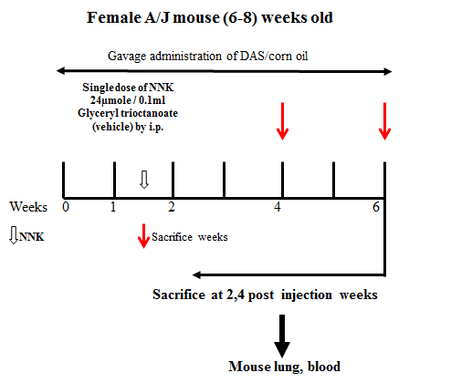

Date: `r date()`     
Scientist: [Rasika Hudlikar](rasikahudlikar@gmail.com)      
Sequencing (Waksman): [Dibyendu Kumar](mailto:dk@waksman.rutgers.edu)      
Statistics: [Davit Sargsyan](mailto:sargdavid@gmail.com)      
Principal Investigator: [Ah-Ng Kong](mailto:kongt@pharmacy.rutgers.edu) 

```{}
# Taxonomic Ranks:
# **K**ing **P**hillip **C**an n**O**t **F**ind **G**reen **S**ocks
# * Kingdom                
# * Phylum                    
# * Class                   
# * Order                   
# * Family     
# * Genus     
# * Species  
```

```{r setup}
# options(stringsAsFactors = FALSE,
#         scipen = 999)

# # Increase mmemory size to 64 Gb----
# invisible(utils::memory.limit(65536))


# str(knitr::opts_chunk$get())
# # NOTE: the below does not work!
# knitr::opts_chunk$set(echo = FALSE, 
#                       message = FALSE,
#                       warning = FALSE,
#                       error = FALSE)

# require(knitr)
# require(kableExtra)
require(phyloseq)
# require(shiny)

require(data.table)
require(ggplot2)
require(plotly)
require(DT)
require(lmerTest)

source("source/functions_may2019.R")

# On Windows set multithread=FALSE----
mt <- TRUE
```

# Introduction
A/J inbred mice from the Jackson Laboratory are used to model cancer and for carcinogen testing given their high susceptibility to carcinogen-induced tumors.  
  
From [Cayman Chemical](https://www.caymanchem.com/product/20894/diallyl-sulfide):Diallyl sulfide is a thioether found in garlic that can modulate the cytochrome P450 drug metabolizing system, activate the constitutive androstane receptor to regulate multidrug resistance-associated proteins, and upregulate the expression of detoxifying enzymes. Garlic-derived organosulfides such as diallyl sulfide have been shown to be highly protective from chemically-induced carcinogenesis in animals.  
  
Nicotine-derived nitrosamine ketone (NNK) is one of the key tobacco-specific nitrosamines derived from nicotine. It plays an important role in carcinogenesis.  
  
Nine (9) A/J mice were used in this study, 3 in each of the 3 treatment groups: Vehicle control (VC), NNK control and NNK+DAS. The study design is as follows:  
  
  
DAS in corn oil was force-fed to mice throghout the study (weeks 0 to 6). A single dose of 24uM/0.1mL NNK suspended in glyceryl trioctate vehicle was injected at Week 1 intraperetoneally (IP). The vehicvle control group received vehicle only. Fecal samples were collected at 4 timepoints: before DAS treatment began (Week 0), and 1, 2 and 4 weeks after pretreatment (Week 1, Week 2 and Week 4 respectively).  

# Data preprocessing
## Raw Data 
FastQ files were downloaded from [Rutgers Box](https://rutgers.app.box.com/folder/99758165982). A total of 72 files (2 per sample, pair-ended) were downloaded. 

## Script
This script (***nrf2ubiome_dada2_jan2020_v1.Rmd***) was developed using [DADA2 Pipeline Tutorial (1.12)](https://benjjneb.github.io/dada2/tutorial.html) with tips and tricks from the [University of Maryland Shool of Medicine Institute for Genome Sciences (IGS)](http://www.igs.umaryland.edu/) [Microbiome Analysis Workshop (April 8-11, 2019)](http://www.igs.umaryland.edu/education/wkshp_metagenome.php). The output of the DADA2 script (***data_jan2020/ps_jan2020.RData***) is explored in this document.

# Meta data: sample description
```{r data}
# Load data----
# Counts
load("data_jan2020/ps_jan2020.RData")
ps_jan2020@sam_data

# Taxonomy
load("data_jan2020/taxa.RData")
taxa <- data.table(seq16s = rownames(taxa),
                   taxa)
head(taxa)
```

CONTINUE HERE!!! 02/29/2020

# Samples
```{r samples}
ps_jan2020@sam_data$Treatment <- factor(ps_jan2020@sam_data$Treatment,
                                        levels = c("NNK control",
                                                   "Vehicle control (VC)",
                                                   "NNK+DAS"))
ps_jan2020@sam_data$ID <- factor(ps_jan2020@sam_data$ID,
                                 levels = unique(ps_jan2020@sam_data$ID))
ps_jan2020@sam_data$Week <- factor(ps_jan2020@sam_data$Week,
                                   levels = c("Week0",
                                              "Week1",
                                              "Week2",
                                              "Week4"))
samples <- ps_jan2020@sam_data
datatable(samples,
          options = list(pageLength = nrow(samples)))
```

# Prune data
The OTUs were mapped to Bacteria (98.45%) and Eukaryota (1.30%) kingdoms, and  16 OTUs (0.26%) undefined. 

```{r check_mapping_kingdom, warning = FALSE, echo = FALSE, message = FALSE}
t1 <- data.table(table(tax_table(ps_jan2020)[, "Kingdom"],
                       exclude = NULL))
t1$V1[is.na(t1$V1)] <- "Unknown"

t1[, pct := N/sum(N)]
setorder(t1, -N)

colnames(t1) <- c("Kingdom",
                  "Number of OTUs",
                  "Percent of OTUs")
datatable(t1,
          rownames = FALSE,
          caption = "Number of OTUs by Kingdom",
          class = "cell-border stripe",
          options = list(search = FALSE,
                         pageLength = nrow(t1))) %>%
  formatCurrency(columns = 2,
                 currency = "",
                 mark = ",",
                 digits = 0) %>%
  formatPercentage(columns = 3,
                   digits = 2)
```

The total of 6,174 unique sequences were found. Out of those, 6,078 were mapped to bacterial genomes. 

```{r keep_bacteria}
dim(ps_jan2020@otu_table@.Data)

# Remove OTU not mapped to Bacteria
ps0 <- subset_taxa(ps_jan2020, 
                   Kingdom == "Bacteria")
dim(ps0@otu_table@.Data)
```
  
Out of the 6,078 OTUs 6,044 belonged to 13 Phylum. 34 of the OTUs (or 0.56% of bacterial OTUs) could not be mapped to a phylum.

```{r phylum_mapping}
t2 <- data.table(table(tax_table(ps0)[, "Phylum"],
                                  exclude = NULL))
t2$V1[is.na(t2$V1)] <- "Unknown"
setorder(t2, -N)
t2[, pct := N/sum(N)]
setorder(t2, -N)

colnames(t2) <- c("Phylum",
                  "Number of OTUs",
                  "Percent of OTUs")

datatable(t2,
          rownames = FALSE,
          caption = "Number of Bacterial OTUs by Phylum",
          class = "cell-border stripe",
          options = list(search = FALSE,
                         pageLength = nrow(t2))) %>%
  formatCurrency(columns = 2,
                 currency = "",
                 mark = ",",
                 digits = 0) %>%
  formatPercentage(columns = 3,
                   digits = 2)
```

# OTU table (first 10 rows)
```{r otu_table, warning=FALSE,echo=FALSE,message=FALSE}
otu <- data.table(ps0@tax_table@.Data,
                  t(ps0@otu_table@.Data))
datatable(head(otu, 10),
          rownames = FALSE,
          caption = "Taxonomic  count table",
          class = "cell-border stripe",
          options = list(search = FALSE,
                         pageLength = 10)) %>%
  formatCurrency(columns = 7:36,
                 currency = "",
                 mark = ",",
                 digits = 0)
```

# Total counts per sample (i.e. sequencing depth)
```{r seq_depth, fig.width = 10,fig.height = 5}
t1 <- colSums(otu[, 7:ncol(otu)])
t1 <- data.table(SAMPLE_NAME = names(t1),
                 Total = t1)

t2 <- data.table(SAMPLE_NAME = rownames(samples),
                 ID = samples$ID,
                 TREATMENT = samples$Treatment,
                 WEEK = samples$Week)

smpl <- merge(t1,
              t2,
              by = "SAMPLE_NAME")

p1 <- ggplot(smpl,
             aes(x = SAMPLE_NAME,
                 y = Total,
                 fill = TREATMENT,
                 colour = WEEK)) +
  geom_bar(stat = "identity") +
  scale_x_discrete("") +
  scale_y_continuous("Number of Reads") +
  scale_fill_discrete("Treatment") +
  theme(axis.text.x = element_text(angle = 45,
                                   hjust = 1)) 
ggplotly(p1)
```

# Richness (Alpha diversity)
Shannon index (aka Shannon enthrophy) is calculated as:  
H' = -sum(1 to R)p(i)ln(p(i)) 
When there is exactly 1 type of data (e.g. a single species in the sample), H'=0. The opposite scenario is when there are R>1 species present in the sample in the exact same amounts and H'=ln(R).  
  
Shannon's diversity index was calculated for each sample and ploted over time using the 7,764 from the 13 Phylum above.
  
```{r shannon_vs_depth, fig.height = 5, fig.width = 6}
shannon.ndx <- estimate_richness(ps0,
                                 measures = "Shannon")

shannon.ndx <- data.table(SAMPLE_NAME = rownames(shannon.ndx),
                          shannon.ndx)

smpl <- merge(smpl,
              shannon.ndx,
              by = "SAMPLE_NAME")

p1 <- ggplot(smpl,
             aes(x = Total,
                 y = Shannon,
                 # shape = WEEK,
                 fill = WEEK)) +
  geom_point(size = 2,
             shape = 21) +
  scale_fill_manual(breaks = unique(smpl$WEEK),
                    values = c("white",
                               "red",
                               "green",
                               "blue"))
  # scale_shape_manual(breaks = unique(smpl$WEEK),
  #                    values = 21:24)

tiff(filename = "tmp/shannon_vs_depth.tiff",
     height = 5,
     width = 6,
     units = "in",
     res = 600,
     compression = "lzw+p")
print(p1)
graphics.off()

ggplotly(p1)
```

Even though ***estimate_richness*** function does not adjust for the sequencing depth, there is no correlation between the index and the sample's sequecing depth. Proceed with the comparison.

# Shannon idex over time
```{r richness, fig.width = 8, fig.height = 5}
p1 <- plot_richness(ps0,
                    x = "Week", 
                    measures = "Shannon") +
  facet_wrap(~ Treatment) +
  geom_line(aes(group = ID),
            color = "black") +
  geom_point(aes(fill = Treatment),
             shape = 21,
             size = 3,
             color = "black") +
  scale_x_discrete("") +
  theme(axis.text.x = element_text(angle = 30,
                                   hjust = 1,
                                   vjust = 1))

ggplotly(p = p1,
         tooltip = c("ID",
                     "value"))

p1 <- p1 + 
  scale_fill_discrete("") +
  theme(legend.position = "top")

tiff(filename = "tmp/shannon.tiff",
     height = 4,
     width = 5,
     units = "in",
     res = 600,
     compression = "lzw+p")
print(p1)
graphics.off()
```

The plot above suggests that the largest differences in alpha diversity (as measured by Shannon's index) are in genotype.
  
Test if the richness changed between the baseline and Week 8.  
  
```{r lm_richness}
smpl$TREATMENT <- factor(smpl$TREATMENT,
                         levels = c("DSS",
                                    "Naive",
                                    "DSS+PEITC",
                                    "DSS+Cranberry"))

tmp <- droplevels(smpl[WEEK != "week1"])

m1 <- lm(Shannon  ~ WEEK*(TREATMENT + Genotype),
         # offset = Total,
         data = tmp)
summary(m1)
```
  
```{r lmer_richness}
m2 <- lmer(Shannon  ~ WEEK*(TREATMENT + Genotype) + (1 | ID),
           # offset = Total,
           data = tmp)
summary(m2)
```

# Calculate change in Shannon index from baseline
```{r delta_shannon, fig.width = 7, fig.height = 5}
dd <- smpl
dd[, delta := Shannon - Shannon[WEEK == "baseline"],
   by = ID]
dd$diff <- paste(dd$WEEK,
                 "-baseline",
                 sep = "")

dd <- dd[WEEK != "baseline",]

p1 <- ggplot(dd,
             aes(x = TREATMENT,
                 y = delta,
                 fill = Genotype)) +
  facet_wrap(~ diff) +
  geom_hline(yintercept = 0,
             linetype = "dashed") +
  geom_point(position = position_dodge(0.3),
             shape = 21,
             size = 3) +
  scale_y_continuous("Shannon Index Percent Change from Baseline") +
  theme(axis.text.x = element_text(angle = 45,
                                   hjust = 1))
print(p1)

dd1$TREATMENT <- factor(dd1$TREATMENT,
                        levels = c("DSS",
                                   "Naive",
                                   "DSS+PEITC",
                                   "DSS+Cranberry"))
dd1$Genotype <- factor(dd1$Genotype,
                       levels = c("widetype",
                                  "nrf2KO"))

m1 <- lm(delta ~ TREATMENT*Genotype,
         data = dd1)
summary(m1)

# No significant interactions, proceed with 2-way analysis
m2 <- lm(delta ~ TREATMENT + Genotype,
         data = dd1)
summary(m2)
```

At Week 8 there was significantly smaller increase of alpha diversity from baseline in Nrf2 KO compared to WT, and in DSS+Cranberry compared to DSS only.

# Load aminoacids
```{r aminoacids}
aa <- fread("data_jan2020/jan2020_aminoacids.csv")
```


CONTINUE HERE! (2/11/2020)

The results showed that...


# Remove unmapped OTUs
The 311 unmapped OTUs were removed from further analysis (with 7,247 OTUs left).
```{r remove_unmapped_otu_phylum}
ps1 <- subset_taxa(ps0, 
                   !is.na(Phylum))
dim(ps1@otu_table@.Data)
```

# Counts at Phylum level
```{r counts_p, warning=FALSE,echo=FALSE,message=FALSE}
counts_p <- counts_by_tax_rank(dt1 = otu,
                               aggr_by = "Phylum")
setorder(counts_p, -`190919-01`)
datatable(counts_p,
          rownames = FALSE,
          caption = "Taxonomic  count table",
          class = "cell-border stripe",
          options = list(search = FALSE,
                         pageLength = nrow(counts_p))) %>%
  formatCurrency(columns = 2:ncol(counts_p),
                 currency = "",
                 mark = ",",
                 digits = 0)
```

# Relative abundance (%) at Phylum level
```{r ra_p, warning=FALSE,echo=FALSE,message=FALSE}
ra_p <- ra_by_tax_rank(counts = counts_p,
                       pct = FALSE,
                       digit = 4)

datatable(ra_p,
          rownames = FALSE,
          caption = "Taxonomic  count table",
          class = "cell-border stripe",
          options = list(search = FALSE,
                         pageLength = nrow(ra_p))) %>%
  formatPercentage(columns = 2:ncol(counts_p),
                   digits = 2)
```

Remove phyla with relative abundance of >= 1% in less than 10% of samples.

```{r prev_p}
t1 <- data.table(Phylum = ra_p$Phylum,
                 `Number of Samples` = rowSums(ra_p[, 2:ncol(ra_p)] >= 0.01))
t1$`Percent Samples` <-  t1$`Number of Samples`/72

setorder(t1, -`Number of Samples`)
datatable(t1,
          rownames = FALSE,
          caption = "Taxonomic  count table",
          class = "cell-border stripe",
          options = list(search = FALSE,
                         pageLength = nrow(t1))) %>%
  formatPercentage(columns = 3,
                   digits = 1)
```

We will remove Chlamydiae from this analysis.

```{r keep_6_phyla, warning=FALSE,echo=FALSE,message=FALSE}
keep_p <- t1$Phylum[t1$`Percent Samples` >= 0.1]
# # Keep all
# keep_p <- t1$Phylum

paste0(keep_p, collapse = ", ")

ps1 <- subset_taxa(ps0, 
                   Phylum %in% keep_p )
otu1 <- data.table(ps1@tax_table@.Data,
                   t(ps1@otu_table@.Data))

datatable(head(otu1, 10),
          rownames = FALSE,
          caption = "Taxonomic  count table",
          class = "cell-border stripe",
          options = list(search = FALSE,
                         pageLength = 10)) %>%
  formatCurrency(columns = 7:ncol(otu1),
                 currency = "",
                 mark = ",",
                 digits = 0)
```

XX OTUs, down from YY OTUs in the previous table.


# Relative Abundance in Samples at Different Taxonomic Ranks
## 1. Class
```{r counts_c, warning=FALSE,echo=FALSE,message=FALSE,fig.width=15,fig.height=15}
counts_c <- counts_by_tax_rank(dt1 = otu1,
                               aggr_by = "Class")
ra_c <- ra_by_tax_rank(counts_c)

tax.ranks <- unique(otu1[, c("Phylum",
                             "Class")])

ra_c <- merge(tax.ranks,
              ra_c,
              by = "Class")

total <- rowSums(ra_c[, 3:ncol(ra_c)])

ra_c$Class <- factor(ra_c$Class,
                     levels = ra_c$Class[order(total)])

ra_c$Phylum <- factor(ra_c$Phylum,
                      levels = unique(ra_c$Phylum[order(total)]))
tmp <- melt.data.table(data = ra_c,
                       id.vars = 1:2,
                       measure.vars = 3:ncol(counts_c),
                       variable.name = "SAMPLE_NAME",
                       value.name = "RA")

tmp <- merge(data.table(SAMPLE_NAME = smpl$SAMPLE_NAME,
                        WEEK = smpl$WEEK,
                        TREATMENT = smpl$TREATMENT,
                        Genotype = smpl$Genotype),
             tmp,
             by = "SAMPLE_NAME")

# Plot samples
p1 <- ggplot(tmp,
             aes(x = SAMPLE_NAME,
                 y = RA,
                 fill = Class,
                 color = Phylum)) +
  facet_wrap(~ WEEK + TREATMENT + Genotype,
             scales = "free_x",
             nrow = 3) +
  geom_bar(stat = "identity") +
  scale_x_discrete("") +
  scale_y_continuous(expand = c(0, 0)) +
  theme(axis.text.x = element_text(angle = 0,
                                   hjust = 1))
ggplotly(p1)
```

```{r means_c, echo = FALSE, warning = FALSE, message = FALSE}
lra <- ra_melt(ra = ra_c,
               samples = smpl,
               sample_name = "SAMPLE_NAME")

mu <- data.table(aggregate(lra$RA,
                           by = list(Week = lra$WEEK,
                                     Treatment = lra$TREATMENT,
                                     Genotype = lra$Genotype,
                                     Class = lra$Class),
                           FUN = "mean"))
mu[, total := sum(x),
   by = "Class"]
ul <- unique(mu[, c("Class", 
                    "total")])
ul <- ul[order(total),]
mu$Class <- factor(mu$Class,
                   level = ul$Class)
mu$total <- NULL

datatable(mu,
          rownames = FALSE,
          caption = "Taxonomic  count table",
          class = "cell-border stripe",
          options = list(search = FALSE,
                         pageLength = 10,
                         order = list(list(3, 'desc')))) %>%
  formatCurrency(columns = 5,
                 currency = "",
                 mark = ",",
                 digits = 2)
```


```{r means_c_p0, fig.width = 9, fig.height = 7}
mu$Trt_Genotype <- factor(paste(mu$Treatment,
                          mu$Genotype,
                          sep = "_"))

p0 <- ggplot(mu,
             aes(x = Week,
                 y = x,
                 group = Trt_Genotype)) +
  facet_wrap(~ Class,
             scale = "free_y") +
  geom_line(position = position_dodge(0.3)) +
  geom_point(aes(fill = Trt_Genotype),
             shape = 21,
             size = 2,
             alpha = 0.5,
             position = position_dodge(0.3)) +
  scale_x_discrete("") +
  scale_y_continuous("Relative Abundance (%)") +
  theme(legend.position = "top",
        axis.text.x = element_text(angle = 45,
                                   hjust = 1))

tiff(filename = "tmp/wt_class_over_time.tiff",
     height = 5,
     width = 7,
     units = "in",
     res = 600,
     compression = "lzw+p")
print(p0)
graphics.off()

print(p0)
```


```{r means_c_p1, fig.height = 5, fig.width = 9}
p1 <- ggplot(mu,
             aes(x = x,
                 y = Class,
                 color = Trt_Genotype,
                 shape = Week)) +
  geom_point(size = 3,
             alpha = 0.5) +
  geom_vline(xintercept = 1,
             linetype = "dashed") +
  scale_x_continuous("Relative Abundance (%)") +
  theme(legend.position = "top")

tiff(filename = "tmp/wt_class_ra.tiff",
     height = 4,
     width = 7,
     units = "in",
     res = 600,
     compression = "lzw+p")
print(p1)
graphics.off()

ggplotly(p1)
```

## 2. Order
```{r counts_o, warning=FALSE,echo=FALSE,message=FALSE,fig.width=15,fig.height=15}
counts_o <- counts_by_tax_rank(dt1 = otu1,
                               aggr_by = "Order")
ra_o <- ra_by_tax_rank(counts_o)

tax.ranks <- unique(otu1[, c("Phylum",
                             "Order")])

ra_o <- merge(tax.ranks,
              ra_o,
              by = "Order")

total <- rowSums(ra_o[, 3:ncol(ra_o)])

ra_o$Order <- factor(ra_o$Order,
                     levels = ra_o$Order[order(total)])

ra_o$Phylum <- factor(ra_o$Phylum,
                      levels = unique(ra_o$Phylum[order(total)]))
tmp <- melt.data.table(data = ra_o,
                       id.vars = 1:2,
                       measure.vars = 3:ncol(counts_o),
                       variable.name = "SAMPLE_NAME",
                       value.name = "RA")

tmp <- merge(data.table(SAMPLE_NAME = smpl$SAMPLE_NAME,
                        WEEK = smpl$WEEK,
                        TREATMENT = smpl$TREATMENT,
                        Genotype = smpl$Genotype),
             tmp,
             by = "SAMPLE_NAME")

# Plot samples
p1 <- ggplot(tmp,
             aes(x = SAMPLE_NAME,
                 y = RA,
                 fill = Order,
                 color = Phylum)) +
  facet_wrap(~ WEEK + TREATMENT + Genotype,
             scales = "free_x",
             nrow = 3) +
  geom_bar(stat = "identity") +
  scale_x_discrete("") +
  scale_y_continuous(expand = c(0, 0)) +
  theme(axis.text.x = element_text(angle = 0,
                                   hjust = 1))
ggplotly(p1)
```

```{r means_o, echo = FALSE, warning = FALSE, message = FALSE}
lra <- ra_melt(ra = ra_o,
               samples = smpl,
               sample_name = "SAMPLE_NAME")

mu <- data.table(aggregate(lra$RA,
                           by = list(Week = lra$WEEK,
                                     Treatment = lra$TREATMENT,
                                     Genotype = lra$Genotype,
                                     Order = lra$Order),
                           FUN = "mean"))
mu[, total := sum(x),
   by = "Order"]
ul <- unique(mu[, c("Order", 
                    "total")])
ul <- ul[order(total),]
mu$Order <- factor(mu$Order,
                   level = ul$Order)
mu$total <- NULL

datatable(mu,
          rownames = FALSE,
          caption = "Taxonomic  count table",
          class = "cell-border stripe",
          options = list(search = FALSE,
                         pageLength = 10,
                         order = list(list(3, 'desc')))) %>%
  formatCurrency(columns = 5,
                 currency = "",
                 mark = ",",
                 digits = 2)
```

```{r means_o_p0, fig.width = 9, fig.height = 7}
mu$Trt_Genotype <- factor(paste(mu$Treatment,
                                mu$Genotype,
                                sep = "_"))

p0 <- ggplot(mu,
             aes(x = Week,
                 y = x,
                 group = Trt_Genotype)) +
  facet_wrap(~ Order,
             scale = "free_y") +
  geom_line(position = position_dodge(0.3)) +
  geom_point(aes(fill = Trt_Genotype),
             shape = 21,
             size = 2,
             alpha = 0.5,
             position = position_dodge(0.3)) +
  scale_x_discrete("") +
  scale_y_continuous("Relative Abundance (%)") +
  theme(legend.position = "top",
        axis.text.x = element_text(angle = 45,
                                   hjust = 1))

tiff(filename = "tmp/wt_Order_over_time.tiff",
     height = 5,
     width = 7,
     units = "in",
     res = 600,
     compression = "lzw+p")
print(p0)
graphics.off()

print(p0)
```

```{r means_o_p1, fig.height = 5, fig.width = 9}
p1 <- ggplot(mu,
             aes(x = x,
                 y = Order,
                 color = Trt_Genotype,
                 shape = Week)) +
  geom_point(size = 3,
             alpha = 0.5) +
  geom_vline(xintercept = 1,
             linetype = "dashed") +
  scale_x_continuous("Relative Abundance (%)") +
  theme(legend.position = "top")

tiff(filename = "tmp/wt_Order_ra.tiff",
     height = 4,
     width = 7,
     units = "in",
     res = 600,
     compression = "lzw+p")
print(p1)
graphics.off()

ggplotly(p1)
```

## 3. Family
```{r counts_f, warning=FALSE,echo=FALSE,message=FALSE,fig.width=15,fig.height=15}
counts_f <- counts_by_tax_rank(dt1 = otu1,
                               aggr_by = "Family")
ra_f <- ra_by_tax_rank(counts_f)

tax.ranks <- unique(otu1[, c("Phylum",
                             "Family")])

ra_f <- merge(tax.ranks,
              ra_f,
              by = "Family")

total <- rowSums(ra_f[, 3:ncol(ra_f)])

ra_f$Family <- factor(ra_f$Family,
                     levels = ra_f$Family[order(total)])

ra_f$Phylum <- factor(ra_f$Phylum,
                      levels = unique(ra_f$Phylum[order(total)]))
tmp <- melt.data.table(data = ra_f,
                       id.vars = 1:2,
                       measure.vars = 3:ncol(counts_f),
                       variable.name = "SAMPLE_NAME",
                       value.name = "RA")

tmp <- merge(data.table(SAMPLE_NAME = smpl$SAMPLE_NAME,
                        WEEK = smpl$WEEK,
                        TREATMENT = smpl$TREATMENT,
                        Genotype = smpl$Genotype),
             tmp,
             by = "SAMPLE_NAME")

# Plot samples
p1 <- ggplot(tmp,
             aes(x = SAMPLE_NAME,
                 y = RA,
                 fill = Family,
                 color = Phylum)) +
  facet_wrap(~ WEEK + TREATMENT + Genotype,
             scales = "free_x",
             nrow = 3) +
  geom_bar(stat = "identity") +
  scale_x_discrete("") +
  scale_y_continuous(expand = c(0, 0)) +
  theme(axis.text.x = element_text(angle = 0,
                                   hjust = 1))
ggplotly(p1)
```

```{r means_f, echo = FALSE, warning = FALSE, message = FALSE}
lra <- ra_melt(ra = ra_f,
               samples = smpl,
               sample_name = "SAMPLE_NAME")

mu <- data.table(aggregate(lra$RA,
                           by = list(Week = lra$WEEK,
                                     Treatment = lra$TREATMENT,
                                     Genotype = lra$Genotype,
                                     Family = lra$Family),
                           FUN = "mean"))
mu[, total := sum(x),
   by = "Family"]
ul <- unique(mu[, c("Family", 
                    "total")])
ul <- ul[order(total),]
mu$Family <- factor(mu$Family,
                   level = ul$Family)
mu$total <- NULL

datatable(mu,
          rownames = FALSE,
          caption = "Taxonomic  count table",
          class = "cell-border stripe",
          options = list(search = FALSE,
                         pageLength = 10,
                         Family = list(list(3, 'desc')))) %>%
  formatCurrency(columns = 5,
                 currency = "",
                 mark = ",",
                 digits = 2)
```

NOTE: only the first 24 families had large enough counts - ploting only them.  
  
```{r means_f_p0, fig.width = 9, fig.height = 7}
mu$Trt_Genotype <- factor(paste(mu$Treatment,
                                mu$Genotype,
                                sep = "_"))
mu1 <- droplevels(mu[Family %in% levels(mu$Family)[nlevels(mu$Family):(nlevels(mu$Family) - 24)], ])

p0 <- ggplot(mu1,
             aes(x = Week,
                 y = x,
                 group = Trt_Genotype)) +
  facet_wrap(~ Family,
             scale = "free_y") +
  geom_line(position = position_dodge(0.3)) +
  geom_point(aes(fill = Trt_Genotype),
             shape = 21,
             size = 2,
             alpha = 0.5,
             position = position_dodge(0.3)) +
  scale_x_discrete("") +
  scale_y_continuous("Relative Abundance (%)") +
  theme(legend.position = "top",
        axis.text.x = element_text(angle = 45,
                                   hjust = 1))

tiff(filename = "tmp/wt_Family_over_time.tiff",
     height = 7,
     width = 9,
     units = "in",
     res = 600,
     compression = "lzw+p")
print(p0)
graphics.off()

print(p0)
```

```{r means_f_p1, fig.height = 5, fig.width = 9}
p1 <- ggplot(mu1,
             aes(x = x,
                 y = Family,
                 color = Trt_Genotype,
                 shape = Week)) +
  geom_point(size = 3,
             alpha = 0.5) +
  geom_vline(xintercept = 1,
             linetype = "dashed") +
  scale_x_continuous("Relative Abundance (%)") +
  theme(legend.position = "top")

tiff(filename = "tmp/wt_Family_ra.tiff",
     height = 4,
     width = 7,
     units = "in",
     res = 600,
     compression = "lzw+p")
print(p1)
graphics.off()

ggplotly(p1)
```

## 4. Genus
```{r counts_g, warning=FALSE,echo=FALSE,message=FALSE,fig.width=15,fig.height=15}
counts_g <- counts_by_tax_rank(dt1 = otu1,
                               aggr_by = "Genus")
ra_g <- ra_by_tax_rank(counts_g)

tax.ranks <- unique(otu1[, c("Phylum",
                             "Genus")])

ra_g <- merge(tax.ranks,
              ra_g,
              by = "Genus")

total <- rowSums(ra_g[, 3:ncol(ra_g)])

ra_g$Genus <- factor(ra_g$Genus,
                     levels = ra_g$Genus[order(total)])

ra_g$Phylum <- factor(ra_g$Phylum,
                      levels = unique(ra_g$Phylum[order(total)]))
tmp <- melt.data.table(data = ra_g,
                       id.vars = 1:2,
                       measure.vars = 3:ncol(counts_g),
                       variable.name = "SAMPLE_NAME",
                       value.name = "RA")

tmp <- merge(data.table(SAMPLE_NAME = smpl$SAMPLE_NAME,
                        WEEK = smpl$WEEK,
                        TREATMENT = smpl$TREATMENT,
                        Genotype = smpl$Genotype),
             tmp,
             by = "SAMPLE_NAME")

# Plot samples
p1 <- ggplot(tmp,
             aes(x = SAMPLE_NAME,
                 y = RA,
                 fill = Genus,
                 color = Phylum)) +
  facet_wrap(~ WEEK + TREATMENT + Genotype,
             scales = "free_x",
             nrow = 3) +
  geom_bar(stat = "identity") +
  scale_x_discrete("") +
  scale_y_continuous(expand = c(0, 0)) +
  theme(axis.text.x = element_text(angle = 0,
                                   hjust = 1))
ggplotly(p1)
```


```{r means_g, echo = FALSE, warning = FALSE, message = FALSE}
lra <- ra_melt(ra = ra_g,
               samples = smpl,
               sample_name = "SAMPLE_NAME")

mu <- data.table(aggregate(lra$RA,
                           by = list(Week = lra$WEEK,
                                     Treatment = lra$TREATMENT,
                                     Genotype = lra$Genotype,
                                     Genus = lra$Genus),
                           FUN = "mean"))
mu[, total := sum(x),
   by = "Genus"]
ul <- unique(mu[, c("Genus", 
                    "total")])
ul <- ul[order(total),]
mu$Genus <- factor(mu$Genus,
                   level = ul$Genus)
mu$total <- NULL

datatable(mu,
          rownames = FALSE,
          caption = "Taxonomic  count table",
          class = "cell-border stripe",
          options = list(search = FALSE,
                         pageLength = 10,
                         Genus = list(list(3, 'desc')))) %>%
  formatCurrency(columns = 5,
                 currency = "",
                 mark = ",",
                 digits = 2)
```

```{r means_g_p0, fig.width = 9, fig.height = 7}
mu$Trt_Genotype <- factor(paste(mu$Treatment,
                                mu$Genotype,
                                sep = "_"))
mu1 <- droplevels(mu[Genus %in% levels(mu$Genus)[nlevels(mu$Genus):(nlevels(mu$Genus) - 35)], ])

p0 <- ggplot(mu1,
             aes(x = Week,
                 y = x,
                 group = Trt_Genotype)) +
  facet_wrap(~ Genus,
             scale = "free_y") +
  geom_line(position = position_dodge(0.3)) +
  geom_point(aes(fill = Trt_Genotype),
             shape = 21,
             size = 2,
             alpha = 0.5,
             position = position_dodge(0.3)) +
  scale_x_discrete("") +
  scale_y_continuous("Relative Abundance (%)") +
  theme(legend.position = "top",
        axis.text.x = element_text(angle = 45,
                                   hjust = 1))

tiff(filename = "tmp/wt_Genus_over_time.tiff",
     height = 9,
     width = 12,
     units = "in",
     res = 600,
     compression = "lzw+p")
print(p0)
graphics.off()

print(p0)
```

```{r means_g_p1, fig.height = 9, fig.width = 9}
p1 <- ggplot(mu1,
             aes(x = x,
                 y = Genus,
                 color = Trt_Genotype,
                 shape = Week)) +
  geom_point(size = 3,
             alpha = 0.5) +
  geom_vline(xintercept = 1,
             linetype = "dashed") +
  scale_x_continuous("Relative Abundance (%)") +
  theme(legend.position = "top")

tiff(filename = "tmp/wt_Genus_ra.tiff",
     height = 9,
     width = 9,
     units = "in",
     res = 600,
     compression = "lzw+p")
print(p1)
graphics.off()

ggplotly(p1)
```


# Session Information
```{r info,eval=TRUE}
sessionInfo()
```